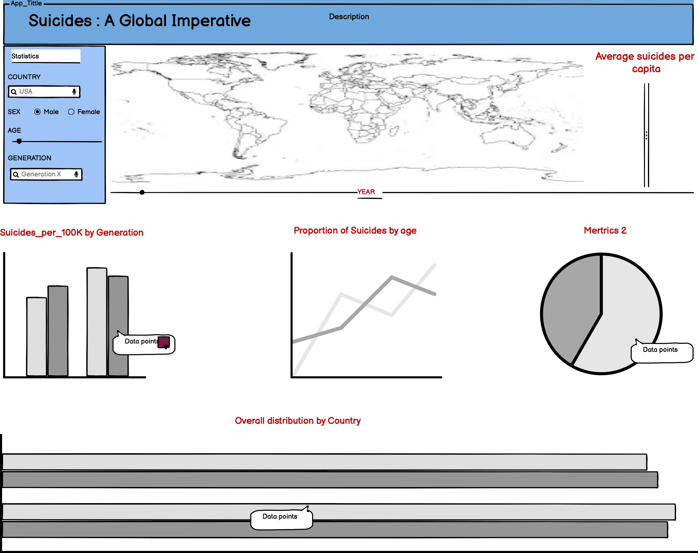

# PROJECT MILESTONE - 1 : PROJECT PROPOSAL

### PROJECT PROPOSAL

**Our Role**: Data Analytics Consultancy Firm for healthcare

**Target audience**: Mental health organizations across the world

Suicide is a very serious public health problem, claiming about 800K deaths per year. Suicide is not just a loss of one individual, it may have a big impact on the families, communities, countries, and other related people left behind. And recently, since a big proportion of suicides are happening in the age group of 15-29 years is a matter of major concern especially for countries who are trying to reduce the average age of the country's population. Suicides were labeled as irresponsible impulsive actions taken by some individuals who are going through some challenges in life and find it difficult to cope with them. But, based on recent studies, suicides have been related to many parameters like financial problems, isolation, abuse, conflict, breakups among many others.

The stimulus behind suicide attempts generally vary from country to country, and some of the factors might trigger certain age group towards this. To address this global challenge, we propose building a data visualization App that would help healthcare organizations visually explore the various factors contributing towards increased suicidal rates and take timely actions to mitigate. The purpose of the App would be to provide an overview where the concerned authorities could filter and reorder the predictors as needed to determine the factors of interest for their concerned patients/communities and take action(s) accordingly. With this app, regional government health organizations could look into the ongoing trends of suicides in the region and propose activities/ events.

### DESCRIPTION OF THE DATA

The dataset is compiled from four other datasets linked by year and country and aims to understand suicide rates for 101 countries across various socio-economic regions between 1986 to 2016. The dataset contains several variables of which Country, Year, Sex, Age, Population, the number of suicides, the proportion of suicides per 100k, Human Development Index (HDI), Gross Domestic Product (GDP) for the year, GDP per capita, and generation were deemed essential for the analysis. Columns country, year, sex, age, and generation were considered to be categorical, with others being continuous. The Human Development Index (HDI) is a composite index measuring average achievement in critical dimensions of human development: standard of living, long and healthy life, and knowledge. These dimensions are then normalized and aggregated using the geometric mean. It must be noted that HDI captures only a part of human development and often fails to reflect on inequalities that might be prevalent in society. This suggests that HDI alone might not be a good measure to understand the dynamics of suicide and was thus used in conjunction with GDP per capita to paint a clearer picture. [Further Details](https://github.com/ubco-mds-2020-labs/data-550-project1-group-6/blob/main/550_project1.ipynb)

### RESEARCH QUESTIONS AND USAGE SCENARIOS

A new team in the firm has been asked to put together some statistics on suicide rates for the past few decades to compile a report for public awareness on suicides and suicide attempts. Jane is a junior Data Analyst who recently graduated and loves to derive insights from the information presented. Jane has read the [description] of the dataset and she wants to [explore] and [analyze] the dataset to get some initial sense. When Jane accesses the app "Suicides: A global imperative”. Jane wants to determine if 'GDP_per_capita' has any influence on the number of suicides in the population. This particular metric could lead her into details of whether economic and social aspects can affect the suicide rates of each country. Jane needs more metrics to decide for certain. Jane currently has a hypothesis that higher GDP has a positive correlation with the absolute number of suicides and she feels there is more to be analyzed with other parameters which are not part of the current dataset.

From the EDA Jane realized there was one more pattern, ie. there is a larger number of suicides associated with men as compared to women. This made her wonder: Are women mentally stable than men? The EDA shows most suicides were seen among the GI generation - which is the generation that lived through and survived the Great War. She understands the reason behind this as this generation had to face the nuclear wars and the great depression. The pressure related to war is more faced by men as compared to women and this can slightly explain the reason for suicides in that generation which is then followed by the silent generation which had to endure the repercussions of the war. She was however worried that this trend continues in the following generations too and cannot find much to explain this issue. Hence she decided to take this as a general research question to understand if the above claim is true with more data like the workmen and women do the psychological stress they face etc.

### DESCRIPTION OF YOUR APP AND SKETCH

The dashboard is split into 5 parts the first part having the world map highlighted with the countries we have in our dataset. Below the map, we have 4 graphs each highlighting different issues that have changed over the years. The values in these graphs will be first displayed for all the countries present in our study. The map is made interactive to choose a country or a set of countries and all the four graphs below will have their values updated by your selection. Furthermore, we have a side panel where we have the option of zooming in your graphs with the help of the slider if you want to view your data for a particular range of years. The side panel also has radio points for selecting several categorical variables like sex and generation, which when selected will update the graphs required and give us the variations for that chosen sex or generation.

